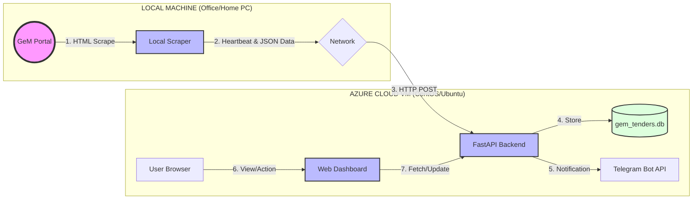

# GeM Tender Automation System | POCT Group

This is a comprehensive hybrid automation system designed to track medical equipment tenders from the Government e-Marketplace (GeM). It consists of a **Local Scraper** that bypasses bot detection and an **Azure Cloud Backend** that provides a high-performance dashboard, analytics, and tracking features.

---

## 📄 Project SRS (System Requirements Specification)

### 1. Project Overview
The system automates the manual effort of searching for tenders on GeM by periodically scraping the portal, filtering results by dynamic keywords/brands, and presenting them in a unified executive dashboard for tracking and follow-up.

### 2. Functional Scope
- **Automated Scraping**: Multi-keyword and multi-page scraping on a local host to bypass cloud-IP blocking.
- **Data Centralization**: Automated HTTP-based data ingestion from local machine to Azure VM.
- **Executive Dashboard**: Dark-mode UI with real-time stats (Total Bids, Tracked: Won/Submitted).
- **Bid Tracking**: Lifecycle management of bids from "Open" to "Submitted", "Won", or "Lost".
- **Notifications**: Instant Telegram alerts for new tenders and system health heartbeats.
- **Data Export**: One-click Excel generation formatted for professional reporting.

---

## 🔄 System-Wide Data Flow Diagram (DFD)

### 📋 Legend & Notation
| Notation | Name | Description |
| :--- | :--- | :--- |
| **(( Circle ))** | External Entity | An external source or system (e.g., GeM Portal). |
| **[ Rectangle ]** | Process/Logic | A software component performing a task (e.g., Scraper, API). |
| **[( Cylinder )]** | Data Store | Persistent storage (SQLite Database). |
| **{ Diamond }** | Boundary/Link | The connecting medium (Internet/Azure Gateway). |
| **Arrow** | Data Direction | Path and direction of information flow. |

---

## 📂 Project Structure

| Component | Directory | Description |
| :--- | :--- | :--- |
| **[Backend](./azure-backend)** | `azure-backend/` | FastAPI server, Dashboard UI, Database, and Analytics. |
| **[Scraper](./local-scraper)** | `local-scraper/` | Playwright-based scraper and scheduler script. |

---

## 🚀 Getting Started

### 1. Backend Setup (On Azure VM)
See the [Backend README](./azure-backend/README.md) for detailed deployment instructions, including setting up the FastAPI server and Uvicorn service.

### 2. Scraper Setup (On Local PC)
See the [Scraper README](./local-scraper/README.md) for instructions on installing Playwright and running the `run_scraper.bat` tool.

---

## 🛡️ Maintainers
- **POCT Group IT Team**
- **Automated GeM Tracker v4.0**
