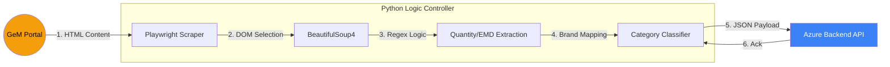

# POCT Group | Local GeM Scraper

A high-performance, resilient web scraper designed to bypass bot detection on the GeM portal and feed real-time tender data to the Azure Backend.

---

## 📄 Software Requirements Specification (SRS)

### 1. Functional Requirements
- **FR1: Automated Discovery**: Search for high-frequency medical categories (Ventilators, Anesthesia, Reagents) on GeM.
- **FR2: Intelligent Parsing**: Extract `Bid Number`, `Quantity`, `EMD Amount`, `Bid Start/End Dates`, and `System Flags`.
- **FR3: MII/MSE Filters**: Identify and tag tenders with "Make in India" or "MSE Preference" flags.
- **FR4: Hybrid Ingestion**: Deliver parsed results as a batch-upload to the Azure VM via HTTP/JSON.
- **FR5: Heartbeat Monitoring**: Automatically ping the backend every cycle to verify connectivity and scraper health.
- **FR6: RA Skipping**: Automatically filter out and skip "Reverse Auction" (RA) tenders.

### 2. Non-Functional Requirements
- **NFR1: Stealth Execution**: Use custom User-Agents and Playwright configuration to avoid 'Bot Detected' blocking.
- **NFR2: Resiliency**: Support automatic retry on network failure or page timeout.
- **NFR3: Low Resource**: Execute in a headless environment without excessive CPU/RAM usage.

---

## 🔄 Data Flow Diagram (DFD)

### 📋 Legend & Notation
| Shape | Notation | Description |
| :--- | :--- | :--- |
| **Double Circle** | External Entity | The GeM Public Portal (The Source). |
| **Rectangle** | Logic Block | Internal parsing and extraction code. |
| **Arrow** | Stream | The flow of extracted bid data from HTML to JSON. |
| **Box Boundary** | Component | The Local Scraper execution environment. |

---

## 🛠️ Tech Stack
- **Engine**: Playwright (Headless Automation)
- **Parser**: BeautifulSoup4 & Python Re (Regex)
- **HTTP Client**: Requests
- **Execution**: Scheduled intervals via `schedule` library.

---

## 🚀 Installation & Setup
1. Install Python 3.9+
2. Install requirements: `pip install -r requirements.txt`.
3. Install Playwright binaries: `playwright install`.
4. Configure endpoints in `config.py`.
5. Run using the one-click batch file: `run_scraper.bat`.
